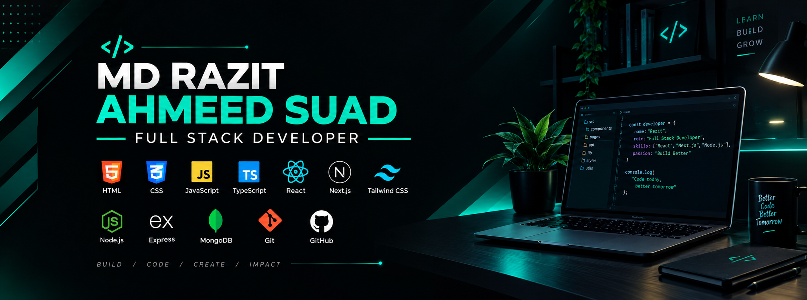

<!-- ===================== BANNER ===================== -->

  

<!-- ===================== NAME ANIMATION ===================== -->

 

  Passionate about building modern, scalable and user-friendly web applications.

 

<!-- ===================== SOCIAL LINKS ===================== -->

&nbsp;&nbsp;

---

# 👨‍💻 About Me

- 🌱 I’m currently learning **Next.js, TypeScript, Node.js, MongoDB & GSAP**
- 👯 I’m looking to collaborate on **Full Stack Web Development Projects**
- 🤝 I’m looking for help with **Advanced Next.js, Backend Development & Deployment**
- 💬 Ask me about **React, Next.js, JavaScript & Full Stack Development**
- 📫 How to reach me: **razit.ahmed05@gmail.com**
- ⚡ Fun fact: **I love turning ideas into real-world web applications**

---

# 💻 Programming Languages

<table>
<tr>
<td align="center" width="120">

 

<b>C</b>

</td>

<td align="center" width="120">

 

<b>C++</b>

</td>

<td align="center" width="120">

 

<b>Java</b>

</td>

<td align="center" width="120">

 

<b>JavaScript</b>

</td>

<td align="center" width="120">

 

<b>Python</b>

</td>

<td align="center" width="120">

 

<b>TypeScript</b>

</td>
</tr>
</table>

---

# 🎨 Frontend Development

<table>
<tr>

<td align="center" width="120">

 

<b>HTML5</b>

</td>

<td align="center" width="120">

 

<b>CSS3</b>

</td>

<td align="center" width="120">

 

<b>JavaScript</b>

</td>

<td align="center" width="120">

 

<b>React</b>

</td>

<td align="center" width="120">

 

<b>Next.js</b>

</td>

<td align="center" width="120">

 

<b>Tailwind CSS</b>

</td>

<td align="center" width="120">

 

<b>DaisyUI</b>

</td>

</tr>
</table>

---

# ⚙️ Backend Development

<table>
<tr>

<td align="center" width="140">

 

<b>Node.js</b>

</td>

<td align="center" width="140">

 

<b>Django</b>

</td>

</tr>
</table>

---

# 🗄️ Database & Backend Services

<table>
<tr>

<td align="center" width="140">

 

<b>MongoDB</b>

</td>

<td align="center" width="140">

 

<b>MySQL</b>

</td>

<td align="center" width="140">

 

<b>Firebase</b>

</td>

</tr>
</table>

---

# 🎬 Animation & Libraries

<table>
<tr>

<td align="center" width="140">

 

<b>GSAP</b>

</td>

<td align="center" width="140">

 

<b>NPM</b>

</td>

</tr>
</table>

---

# 🛠️ Tools & Technologies

<table>
<tr>

<td align="center" width="120">

 

<b>Git</b>

</td>

<td align="center" width="120">

 

<b>GitHub</b>

</td>

<td align="center" width="120">

 

<b>Figma</b>

</td>

<td align="center" width="120">

 

<b>Arduino</b>

</td>

<td align="center" width="120">

 

<b>Prettier</b>

</td>

</tr>
</table>

---

# ☁️ Deployment & Hosting

<table>
<tr>

<td align="center" width="140">

 

<b>Vercel</b>

</td>

<td align="center" width="140">

 

<b>Netlify</b>

</td>

</tr>
</table>

---

# 🌐 Connect With Me

&nbsp;&nbsp;&nbsp;&nbsp;&nbsp;&nbsp;

---

# 📊 GitHub Statistics

&nbsp;&nbsp;&nbsp;&nbsp;

---

# 📈 Most Used Languages

---

### 💻 Building Ideas Into Reality 🚀

⭐ **Thanks for visiting my profile!**

